# Agent Gateway — Complete Step-by-Step Guide

**Source:** [agentgateway.dev](https://agentgateway.dev) · Part of the **Agentic AI Foundation (AAIF)** · Apache 2.0 · Linux Foundation

---

## What is Agent Gateway?

Agent Gateway is an open-source, high-performance **unified data plane** for all AI traffic. Instead of running separate gateways for your LLM calls, your MCP tool traffic, your A2A agent communication, and your regular HTTP/gRPC services, Agent Gateway handles everything in a **single binary**.

### The fragmentation problem it solves

| Without Agent Gateway | With Agent Gateway |
|---|---|
| Separate LLM proxy per provider | One OpenAI-compatible endpoint for all 12+ providers |
| No auth on MCP tool calls | RBAC + JWT + audit log on every tool call |
| Agents call each other directly | A2A protocol routing with identity + tracing |
| No governance on LLM spend | Per-team token budgets, guardrails, PII-shield |
| OTel spans wired per-service | One span per call emitted automatically |
| mTLS configured per hop | Gateway handles mTLS and OIDC transparently |

### Architecture in one sentence

> Your agents talk to Agent Gateway. Gateway authenticates, routes, observes, and governs every request before forwarding it to LLMs, MCP servers, other agents, or internal HTTP services.

### Architecture Diagram

```mermaid
graph TB
    subgraph "Client Layer"
        User[User Query]
        Coordinator[Coordinator Agent]
    end

    subgraph "Agent Gateway - Central Data Plane"
        Gateway[Agent Gateway]
        
        subgraph "Gateway Ports"
            Port3000[Port 3000<br/>A2A / HTTP Traffic]
            Port4000[Port 4000<br/>LLM Gateway]
            Port3100[Port 3100<br/>MCP Tools]
            Port15000[Port 15000<br/>Admin UI]
        end
        
        subgraph "Gateway Functions"
            Auth[Authentication<br/>JWT / mTLS / OIDC]
            RateLimit[Rate Limiting]
            Audit[Audit Logging]
            OTel[OpenTelemetry Tracing]
            Policy[Policy Enforcement<br/>OPA / Guardrails]
            Routing[Request Routing]
        end
    end

    subgraph "Worker Agents"
        ResearchAgent[Research Agent<br/>Port 9999]
        OtherAgents[Other A2A Agents]
    end

    subgraph "External Services"
        subgraph "LLM Providers"
            Anthropic[Anthropic / Claude]
            OpenAI[OpenAI]
            Gemini[Google Gemini]
            DeepSeek[DeepSeek]
            Others[Other Providers]
        end
        
        subgraph "MCP Servers"
            GitHubMCP[GitHub MCP Server]
            OtherMCP[Other MCP Servers]
        end
        
        subgraph "Inference Backends"
            vLLM[vLLM GPU Pool]
            Triton[Triton Inference]
            TGI[TGI Serving]
        end
    end

    %% User to Coordinator
    User -->|Query| Coordinator

    %% Coordinator to Gateway (A2A)
    Coordinator -->|A2A Protocol<br/>POST /tasks/send| Port3000
    Coordinator -->|Discovery<br/>GET /.well-known/agent.json| Port3000

    %% Gateway Internal Flow
    Port3000 --> Auth
    Auth --> RateLimit
    RateLimit --> Audit
    Audit --> OTel
    OTel --> Policy
    Policy --> Routing

    %% Gateway to Workers
    Routing -->|A2A Request| ResearchAgent
    Routing -->|A2A Request| OtherAgents

    %% Worker Response Flow
    ResearchAgent -->|A2A Response| Port3000
    OtherAgents -->|A2A Response| Port3000

    %% Gateway to LLM Providers
    Port4000 -->|OpenAI-compatible API| Anthropic
    Port4000 -->|OpenAI-compatible API| OpenAI
    Port4000 -->|OpenAI-compatible API| Gemini
    Port4000 -->|OpenAI-compatible API| DeepSeek
    Port4000 -->|OpenAI-compatible API| Others

    %% Gateway to MCP Servers
    Port3100 -->|MCP Protocol<br/>RBAC + Audit| GitHubMCP
    Port3100 -->|MCP Protocol<br/>RBAC + Audit| OtherMCP

    %% Gateway to Inference Backends
    Gateway -->|Inference Routing<br/>Latency-aware| vLLM
    Gateway -->|Inference Routing<br/>Latency-aware| Triton
    Gateway -->|Inference Routing<br/>Latency-aware| TGI

    %% Admin UI
    Port15000 --> AdminUI[Admin Dashboard<br/>Routes, Traces, Logs]

    %% Styling
    style Gateway fill:#4a90e2,stroke:#2c5aa0,stroke-width:3px,color:#fff
    style Coordinator fill:#f39c12,stroke:#d68910,stroke-width:2px,color:#fff
    style ResearchAgent fill:#27ae60,stroke:#1e8449,stroke-width:2px,color:#fff
    style Port3000 fill:#e74c3c,stroke:#c0392b,stroke-width:2px,color:#fff
    style Port4000 fill:#9b59b6,stroke:#8e44ad,stroke-width:2px,color:#fff
    style Port3100 fill:#1abc9c,stroke:#16a085,stroke-width:2px,color:#fff
```



### Agentic Patterns Flow

```mermaid
graph TD
    subgraph "Coordinator Agent - Four Patterns"
        UserQuery[User Query]
        
        subgraph "Pattern 1: Supervisor-Worker"
            WorkerRegistry[Worker Registry]
            Discover[Discover Workers via<br/>/.well-known/agent.json]
        end
        
        subgraph "Pattern 2: Plan-and-Execute"
            Planner[Planner LLM Call]
            SubTasks[SubTask Objects]
            Executor[Executor Loop]
        end
        
        subgraph "Pattern 3: ReAct Loop"
            Thought1[Thought 1]
            Action1[Action 1]
            Obs1[Observation 1]
            Thought2[Thought 2]
            Action2[Action 2]
            Obs2[Observation 2]
        end
        
        subgraph "Pattern 4: Reflection/Critic"
            Draft[Phase 1: Draft]
            Critique[Phase 2: Critique]
            Revise[Phase 3: Revise<br/>if needed]
        end
    end

    UserQuery --> WorkerRegistry
    WorkerRegistry --> Discover
    Discover --> Planner
    
    Planner -->|Multi-step| SubTasks
    Planner -->|Single-step| Thought1
    
    SubTasks --> Executor
    Executor --> Thought1
    
    Thought1 --> Action1
    Action1 -->|via Gateway| Obs1
    Obs1 --> Thought2
    Thought2 --> Action2
    Action2 -->|via Gateway| Obs2
    Obs2 -->|Final Answer| UserQuery
    
    Action1 -->|via Gateway| Draft
    Draft --> Critique
    Critique -->|Issues found| Revise
    Critique -->|Approved| Action1
    Revise --> Action1

    style WorkerRegistry fill:#3498db,stroke:#2980b9,color:#fff
    style Planner fill:#e67e22,stroke:#d35400,color:#fff
    style Thought1 fill:#9b59b6,stroke:#8e44ad,color:#fff
    style Draft fill:#1abc9c,stroke:#16a085,color:#fff
    style Critique fill:#e74c3c,stroke:#c0392b,color:#fff
```



---

## Prerequisites

- Python 3.11+
- `pip install fastapi uvicorn anthropic httpx`
- An Anthropic API key (`ANTHROPIC_API_KEY`)
- `curl` or a terminal

---

## Part 1 — Install Agent Gateway

### Step 1: Install the binary

```bash
curl -sL https://agentgateway.dev/install | bash
# or with Docker:
docker pull ghcr.io/agentgateway/agentgateway:latest
```

Verify:

```bash
agentgateway --version
```

### Step 2: Start with the minimal config

Use `config/config_minimal.yaml` from this repo:

```bash
agentgateway -f config/config_minimal.yaml
```

You should see:

```
INFO agentgateway: Listening on 0.0.0.0:3000   # A2A / HTTP traffic
INFO agentgateway: Listening on 0.0.0.0:4000   # LLM gateway
INFO agentgateway: Admin UI at http://localhost:15000/ui/
```

Open the Admin UI at **http://localhost:15000/ui/** — you can inspect routes, backends, and live traces here without writing any code.

---

## Part 2 — How it fixes Fragmented Agent Infrastructure

Agent Gateway replaces this mess:

```
Agent A  →  OpenAI proxy  →  api.openai.com
Agent A  →  Anthropic SDK  →  api.anthropic.com
Agent A  →  custom MCP shim  →  github-mcp-server
Agent B  →  direct HTTP  →  Agent A (no auth, no trace)
```

With this:

```
Agent A  →  Agent Gateway :3000/:4000  →  any LLM / MCP / agent / service
Agent B  →  Agent Gateway :3000        →  Agent A (with JWT, mTLS, trace)
```

One `config.yaml` describes every route, policy, and backend. See `config/gateway_full.yaml` for the full annotated example.

---

## Part 3 — Building the Research Agent (A2A Server)

The file `agents/research_agent.py` implements a fully A2A-compliant agent using the Anthropic Python SDK. It now uses the **Reflection / Critic** pattern internally to quality-control every answer before returning it.

### What the A2A protocol requires

An A2A agent must expose three things:

1. **Agent card** at `GET /.well-known/agent.json` — describes skills, capabilities, and URL.
2. **Task endpoint** at `POST /tasks/send` — receives a `TaskRequest`, returns a `TaskResponse`.
3. **Streaming endpoint** at `POST /tasks/sendSubscribe` — for server-sent events (optional).

### Step 3: Start the Research Agent

```bash
export ANTHROPIC_API_KEY=sk-ant-...

# Terminal 1
cd agents
pip install fastapi uvicorn anthropic
uvicorn research_agent:app --port 9999 --reload
```

You should see:
```
INFO:     Uvicorn running on http://0.0.0.0:9999
```

### Step 4: Verify the agent card (A2A discovery)

```bash
curl http://localhost:9999/.well-known/agent.json | python -m json.tool
```

Expected response:
```json
{
  "name": "research-agent",
  "description": "Research agent powered by Claude with built-in Reflection quality control...",
  "version": "2.0.0",
  "url": "http://localhost:9999",
  "skills": [
    {"id": "research", "name": "Research any topic"},
    {"id": "summarise", "name": "Summarise text"}
  ]
}
```

### Step 5: Send a task directly (before the gateway)

```bash
curl -X POST http://localhost:9999/tasks/send \
  -H "Content-Type: application/json" \
  -d '{
    "id": "task-001",
    "message": {
      "role": "user",
      "parts": [{"kind": "text", "text": "Explain the A2A protocol in 3 bullet points."}]
    }
  }'
```

The response will include a revision note if the internal critic triggered a rewrite:

```json
{
  "id": "task-001",
  "status": {"state": "completed"},
  "result": {
    "parts": [{
      "kind": "text",
      "text": "...\n\n_(Answer was revised once after internal quality review.)_"
    }]
  }
}
```

---

## Part 4 — Routing Through Agent Gateway (A2A)

### Step 6: Start Agent Gateway (Terminal 2)

```bash
# Terminal 2
agentgateway -f config/config_minimal.yaml
```

### What Agent Gateway adds on every A2A request

```
POST /tasks/send → Gateway :3000
    │
    ├── VALIDATE (JWT / API key if configured)
    ├── RATE LIMIT check
    ├── LOG request to audit trail
    ├── EMIT OTel span start
    ├── REWRITE agent card URL (localhost:9999 → localhost:3000)
    │
    ├── FORWARD to Research Agent :9999
    │
    ├── EMIT OTel span end
    └── RETURN response to caller
```

### Step 7: Send a task through the gateway

```bash
# Same task, but through the gateway (port 3000, not 9999)
curl -X POST http://localhost:3000/tasks/send \
  -H "Content-Type: application/json" \
  -d '{
    "id": "task-via-gateway-001",
    "message": {
      "role": "user",
      "parts": [{"kind": "text", "text": "What is Model Context Protocol?"}]
    }
  }'
```

### Step 8: Discover agents through the gateway

Gateway rewrites the agent card so the URL points to itself:

```bash
curl http://localhost:3000/.well-known/agent.json
# "url" is now "http://localhost:3000" (not :9999)
```

This is how orchestrators discover agents — they only need to know the gateway address.

---

## Part 5 — The Coordinator Agent (Four Agentic Patterns)

`agents/coordinator_agent.py` is a full orchestrator that layers four industry-standard agentic patterns on top of the A2A + Gateway infrastructure.

### Patterns applied

| Pattern | Where in code | What it does |
|---|---|---|
| **Supervisor-Worker** | `WorkerRegistry`, `discover_worker()` | Discovers workers at runtime via their agent cards; routes by skill ID, not hardcoded `if` branches |
| **Plan-and-Execute** | `plan()`, executor loop in `coordinate()` | Decomposes multi-step queries into typed `SubTask` objects, dispatches each independently, then synthesises |
| **ReAct (Reason+Act)** | `react_step()`, `react_loop()` | Threads Thought → Action → Observation turns; Claude reasons over its own prior tool results before the next action |
| **Reflection / Critic** | `reflect_and_answer()` in `research_agent.py` | Research agent self-critiques via adversarial prompt; revises only when genuine issues are found |

### Step 9: Run the coordinator

```bash
# Terminal 3
export ANTHROPIC_API_KEY=sk-ant-...
python agents/coordinator_agent.py
```

The coordinator will:
1. Fetch the agent card from `http://localhost:3000/.well-known/agent.json` and populate the `WorkerRegistry`
2. Call the **Planner** — Claude decides if the query needs multiple steps
3. **Multi-step path**: decompose into subtasks → dispatch each → synthesise results
4. **Single-step path**: enter the **ReAct loop** (Thought → Action → Observation, up to 5 iterations)
5. Print the final answer

### How the A2A message flow works (single-step / ReAct)

```
User query
    │
    ▼
coordinator_agent.py
    ├─ WorkerRegistry.discover()        [Supervisor-Worker]
    ├─ plan() → [] (single-step)        [Plan-and-Execute]
    └─ react_loop()                     [ReAct]
            │  iteration 1
            ├─ Claude: Thought → tool call: delegate_to_research_agent
            │
            ▼
       POST http://localhost:3000/tasks/send
            │
            ▼
       Agent Gateway (auth · rate-limit · audit · OTel)
            │
            ▼
       research_agent.py :9999
            ├─ _draft()                 [Reflection – Phase 1]
            ├─ _critique()             [Reflection – Phase 2]
            └─ _revise() (if needed)   [Reflection – Phase 3]
            │
            ▼
       TaskResponse (A2A)
            │
            ▼  Observation appended to conversation
    ├─ react_loop() iteration 2
    │   Claude: end_turn → final answer
    │
    ▼
synthesis / final answer → user
```

### How the A2A message flow works (multi-step / Plan-and-Execute)

```
User query (e.g. "Compare A2A with MCP, then summarise the benefits of a unified gateway")
    │
    ▼
coordinator_agent.py
    ├─ WorkerRegistry.discover()                     [Supervisor-Worker]
    ├─ plan() → [t1: compare A2A vs MCP,             [Plan-and-Execute]
    │             t2: summarise unified gateway benefits]
    │
    ├─ executor: subtask t1 → research-agent → answer1
    ├─ executor: subtask t2 → research-agent → answer2
    │
    └─ synthesis LLM call: merge answer1 + answer2 → final answer → user
```

---

## Part 6 — LLM Routing Across 12+ Providers

Agent Gateway exposes an **OpenAI-compatible** endpoint at `:4000` regardless of which model you target.

### Step 10: Route to Anthropic Claude

```bash
export ANTHROPIC_API_KEY=sk-ant-...
agentgateway -f config/config_minimal.yaml

curl http://localhost:4000/v1/chat/completions \
  -H "Content-Type: application/json" \
  -d '{
    "model": "claude-sonnet",
    "messages": [{"role": "user", "content": "Hello from agentgateway!"}]
  }'
```

### Step 11: Header-based provider switching

With `config/gateway_full.yaml`, your code stays the same — just change a header:

```bash
# Route to Anthropic
curl http://localhost:3200/v1/chat/completions \
  -H "x-provider: anthropic" \
  -H "Content-Type: application/json" \
  -d '{"model": "claude-sonnet-4-20250514", "messages": [...]}'

# Route to Gemini
curl http://localhost:3200/v1/chat/completions \
  -H "x-provider: gemini" \
  -H "Content-Type: application/json" \
  -d '{"model": "gemini-2.0-flash", "messages": [...]}'

# Route to DeepSeek
curl http://localhost:3200/v1/chat/completions \
  -H "x-provider: deepseek" \
  -H "Content-Type: application/json" \
  -d '{"model": "deepseek-chat", "messages": [...]}'

# Default → OpenAI (no header needed)
curl http://localhost:3200/v1/chat/completions \
  -H "Content-Type: application/json" \
  -d '{"model": "gpt-4o-mini", "messages": [...]}'
```

The gateway handles API key injection, request translation, and failover — your agent code changes nothing.

### Providers supported out of the box

| Provider | Config value |
|---|---|
| Anthropic / Claude | `anthropic` |
| OpenAI | `openAI` |
| Google Gemini | `gemini` |
| Google Vertex AI | `vertex` |
| Amazon Bedrock | `bedrock` |
| Azure OpenAI | `azure` |
| DeepSeek | `openAI` + `hostOverride` |
| xAI / Grok | `openAI` + `hostOverride` |
| Mistral | `openAI` + `hostOverride` |
| Ollama (local) | `openAI` + `hostOverride: localhost:11434` |
| Perplexity | `openAI` + `hostOverride` |
| Replicate | `openAI` + `hostOverride` |

---

## Part 7 — Inference Routing Across GPU Pools

For self-hosted models on vLLM, Triton, or TGI:

```yaml
# In gateway_full.yaml — inference section
inference:
  backends:
    - name: vllm-a
      host: "vllm-a.internal:8000"
      model: "meta-llama/Llama-3-8B-Instruct"
      priority: 1        # gateway picks lowest latency / shortest queue
    - name: vllm-b
      host: "vllm-b.internal:8000"
      model: "meta-llama/Llama-3-8B-Instruct"
      priority: 2
```

Gateway selects the warmest replica automatically. Your agent just calls:

```bash
curl http://localhost:4000/v1/chat/completions \
  -d '{"model": "meta-llama/Llama-3-8B-Instruct", "messages": [...]}'
```

---

## Part 8 — MCP Tool Connectivity and Discovery

### Step 12: Connect to a GitHub MCP server

Add to your config:

```yaml
# On port 3100
- port: 3100
  listeners:
  - routes:
    - name: github-mcp
      matches:
      - path:
          pathPrefix: /mcp/github
      backends:
      - mcp:
          streamableHttp:
            host: mcp.github.com
            port: 443
            tls: true
      policies:
        mcpAuth:
          apiKey: "$GITHUB_TOKEN"
        mcpAuthz:
          rules:
          - allow: ["tools/list", "tools/call/get_file_contents"]
```

Then discover tools via the gateway:

```bash
curl http://localhost:3100/mcp/github \
  -H "Content-Type: application/json" \
  -d '{"jsonrpc":"2.0","method":"tools/list","id":1}'
```

Gateway adds:
- **RBAC** — only whitelisted tool calls pass through.
- **Audit log** — every `tools/call` is recorded with caller identity.
- **OTel span** — per-tool trace for your observability stack.
- **Versioning** — pin MCP server versions; roll back without changing agent code.

---

## Part 9 — HTTP/gRPC/TCP with mTLS + OIDC

### mTLS between gateway and backends

```yaml
# In any route's policies block:
backendTls:
  mode: MUTUAL
  clientCertSecret: my-client-cert-secret
```

Gateway rotates the mTLS certificate automatically. Your backend services never need to manage certs directly.

### OIDC browser authentication (for web UIs)

```yaml
policies:
  oidc:
    issuer: "https://accounts.google.com"
    clientId: "$OIDC_CLIENT_ID"
    clientSecret: "$OIDC_CLIENT_SECRET"
    redirectUri: "http://localhost:3000/callback"
```

### JWT authentication for agent calls

```yaml
policies:
  jwtAuthn:
    providers:
    - name: my-idp
      issuer: "https://my-auth.example.com/"
      audiences: ["agentgateway"]
      jwksUri: "https://my-auth.example.com/.well-known/jwks.json"
```

Any request without a valid JWT is rejected before reaching your agents.

---

## Part 10 — Per-Call Traces, Logs, and Policy Decisions

### Step 13: Enable OpenTelemetry

```bash
export OTEL_EXPORTER_OTLP_ENDPOINT=http://localhost:4317
export OTEL_SERVICE_NAME=agentgateway
agentgateway -f config/config_minimal.yaml
```

Every call now emits a span with:
- `agent.task.id` — A2A task identifier
- `llm.model` — model name
- `llm.tokens.input` / `llm.tokens.output`
- `mcp.tool.name` — for MCP calls
- `http.status_code`

### Step 14: View live traces in the Admin UI

Open **http://localhost:15000/ui/traces** — no Jaeger/Grafana needed for local development.

### Governance — OPA policy decisions

Gateway evaluates an OPA policy on every call. Example: deny requests without a valid `x-team` header:

```rego
# policy.rego
package agentgateway.authz

default allow = false

allow {
    input.request.headers["x-team"]
}
```

The policy decision (allow/deny) is stored in the audit log alongside the full request metadata, giving compliance teams a tamper-evident record of every agent action.

### Audit log entry structure

```json
{
  "timestamp": "2026-06-09T10:23:41Z",
  "task_id": "task-via-gateway-001",
  "caller": "coordinator-agent",
  "backend": "research-agent:9999",
  "policy_decision": "allow",
  "llm_model": "claude-sonnet-4-20250514",
  "tokens_in": 142,
  "tokens_out": 387,
  "latency_ms": 1234,
  "span_id": "4bf92f3577b34da6"
}
```

---

## Part 11 — Guardrails and Spend Control

Add to any LLM route's `policies` block:

```yaml
llmPolicies:
  promptGuards:
  # Block prompts containing raw credit card numbers
  - type: regex
    patterns: ["\\b\\d{16}\\b"]
    action: BLOCK
    message: "PII detected — request blocked"

  # Per-day token budget per route
  tokenBudget:
    perDay: 1_000_000
    perRequest: 8_192
```

---

## Part 12 — Full End-to-End Test

Run all three components, then test everything:

```bash
# Terminal 1: Research Agent
uvicorn research_agent:app --port 9999

# Terminal 2: Agent Gateway (full config)
agentgateway -f config/gateway_full.yaml

# Terminal 3: Coordinator Agent
python coordinator_agent.py
```

Then manually probe each feature:

```bash
# 1. Agent discovery via gateway
curl http://localhost:3000/.well-known/agent.json

# 2. Send A2A task through gateway (triggers Reflection pipeline inside research agent)
curl -X POST http://localhost:3000/tasks/send \
  -H "Content-Type: application/json" \
  -d '{"id":"e2e-001","message":{"role":"user","parts":[{"kind":"text","text":"What is RAG?"}]}}'

# 3. LLM routing — Claude
curl http://localhost:4000/v1/chat/completions \
  -H "Content-Type: application/json" \
  -d '{"model":"claude-sonnet","messages":[{"role":"user","content":"Ping"}]}'

# 4. LLM routing — switch to Gemini via header
curl http://localhost:3200/v1/chat/completions \
  -H "x-provider: gemini" \
  -H "Content-Type: application/json" \
  -d '{"model":"gemini-2.0-flash","messages":[{"role":"user","content":"Ping"}]}'

# 5. Multi-step coordinator query (triggers Plan-and-Execute path)
python -c "
import asyncio
from coordinator_agent import coordinate
asyncio.run(coordinate('Compare the A2A protocol with MCP, then summarise the key benefits of a unified AI gateway that supports both.'))
"

# 6. View Admin UI (routes, backends, traces)
open http://localhost:15000/ui/
```

---

## Adding a New Worker

Because the coordinator uses **Supervisor-Worker** discovery, adding a new agent requires **zero code changes** to the coordinator:

1. Implement a FastAPI service with `GET /.well-known/agent.json` and `POST /tasks/send`.
2. Declare the skills your agent supports in the agent card (`skills[].id`).
3. Add a route in `config_minimal.yaml` pointing to its host/port.
4. Restart Agent Gateway — the `WorkerRegistry` will discover and register the new worker automatically on the next coordinator startup.

---

## Key Concepts Summary

| Feature | What Agent Gateway does | Config key |
|---|---|---|
| Fragmented infrastructure | Single binary for all AI traffic types | `binds`, `llm`, `inference` |
| Secure agent traffic | JWT, mTLS, OIDC on every hop | `jwtAuthn`, `backendTls`, `oidc` |
| LLM routing | OpenAI-compat API for 12+ providers | `llm.models[]` |
| Inference routing | Latency-aware GPU pool selection | `inference.backends[]` |
| A2A support | A2A protocol parse, auth, rewrite, trace | `a2a: {}` |
| MCP support | Tool discovery, RBAC, audit | `mcp.streamableHttp`, `mcpAuthz` |
| Agent discovery | Agent card proxied + URL rewritten | automatic with `a2a: {}` |
| Sending messages | `POST /tasks/send` to gateway | A2A spec |
| Receiving messages | `POST /tasks/send` on agent server | A2A spec |
| HTTP/gRPC traffic | north–south and east–west routing | `binds[].listeners[].routes[]` |
| mTLS + OIDC | Transport security + identity | `backendTls`, `oidc` |
| Per-call traces | OTel span per LLM/A2A/MCP call | `OTEL_EXPORTER_OTLP_ENDPOINT` |
| Audit logs | Tamper-evident per-decision records | automatic |
| Guardrails | PII-shield, regex filters, budgets | `llmPolicies.promptGuards` |

### Agentic Pattern Summary

| Pattern | File | Key classes / functions | Benefit |
|---|---|---|---|
| Supervisor-Worker | `coordinator_agent.py` | `WorkerRegistry`, `discover_worker()` | Add workers via config, not code |
| Plan-and-Execute | `coordinator_agent.py` | `plan()`, `SubTask`, executor loop | Handles multi-step queries cleanly |
| ReAct (Reason+Act) | `coordinator_agent.py` | `react_step()`, `react_loop()` | Claude reasons over prior observations before next action |
| Reflection / Critic | `research_agent.py` | `reflect_and_answer()`, `_draft()`, `_critique()`, `_revise()` | Adversarial self-critique before answer delivery |

---

## Resources

- Docs: https://agentgateway.dev/docs/standalone/latest/
- A2A tutorial: https://agentgateway.dev/docs/standalone/latest/tutorials/a2a/
- LLM gateway tutorial: https://agentgateway.dev/docs/standalone/latest/tutorials/llm-gateway/
- MCP connectivity: https://agentgateway.dev/docs/standalone/latest/mcp/
- GitHub: https://github.com/agentgateway/agentgateway
- Discord: https://discord.gg/y9efgEmppm
- AAIF: https://aaif.io
- Agent Patterns Catalog: https://agentpatternscatalog.org
